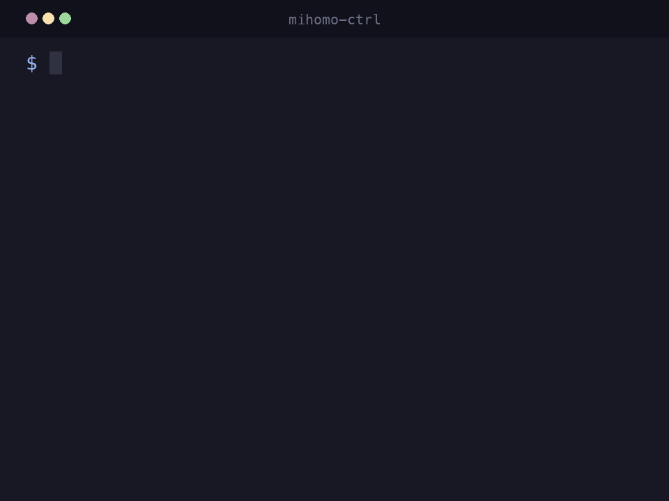

# mihomo-ctrl - Mihomo CLI 控制工具

快教会你的 AI Agent 用 mihomo-ctrl 来克服网络障碍。



> ⚠️ [mihomo-ctrl](https://github.com/wonder-missing/mihomo-ctrl) 并不包含 Mihomo 内核本身，请自行参阅 [Mihomo 文档](https://wiki.metacubex.one/)。

本工具最初为 AI Agent 而作，由于 Claude Code 在帮我探索第三方 API 过程中频繁因 `429 Too Many Requests`、`403 Forbidden` 甚至网络不可达而敷衍了事。

而我的系统早就安装配置好了 Mihomo + 分层代理组 + 灵活的规则，我意识到必须让 AI Agent 方便地观察、切换代理来克服网络障碍。Agent 友好的工具应该是 CLI 形态的，便有了 **mihomo-ctrl**。

拿到 `mihomo-ctrl`，只需 `--help` 就能得到所有的信息，输出本身就能充当一份 *SKILL*。

## 📦 安装

前置条件：Mihomo 正常运行中，External Controller 可访问（默认 `http://127.0.0.1:9090`）。若 Controller 开了 secret，先设置 `MIHOMO_SECRET`。运行时需要 Python 3.9+，优先使用系统里已有的解释器。

已安装 [uv](https://github.com/astral-sh/uv) 时（推荐），二选一：

**PyPI** · 已打 tag 的发布版

```bash
uv tool install "mihomo-ctrl[tui]"
```

**GitHub** · `main` 上的最新提交（不必等发版）

```bash
uv tool install "mihomo-ctrl[tui] @ git+https://github.com/wonder-missing/mihomo-ctrl"
```

已安装 [pipx](https://pipx.pypa.io/) 时：

```bash
pipx install "mihomo-ctrl[tui]"
```

若没有 uv / pipx，可以用下面的脚本（从 GitHub `main` 安装）。**脚本会先安装 uv 到 `~/.local/bin`，并在继续前询问确认**：

```bash
curl -fsSL https://raw.githubusercontent.com/wonder-missing/mihomo-ctrl/main/install.sh | bash
```

装完后命令在 `~/.local/bin`。若该目录不在 PATH 里，加进去。

装完先确认能连上：

```bash
mihomo-ctrl lsg
```

连不上时检查 Mihomo 是否在跑，并用环境变量改地址或密钥（见下方「配置」）。

## 🌐 使用 mihomo-ctrl 克服网络障碍

> 👻 注意：本小节旨在为你提供一个教导 AI Agent 的模板，你可以直接复制粘贴到 `AGENTS.md` 或 `CLAUDE.md` 等文件中（记得删掉这一段）。

访问外部 API（Yahoo Finance、Finnhub 等）时可能遭遇 IP 限流（429/403）或连接超时。
本机已部署 Mihomo 代理，通过 `mihomo-ctrl` 切换出口节点即可绕过。

**工具速查**：

```bash
mihomo-ctrl --help  # 查看完整用法
mihomo-ctrl lsg  #  列出代理组及各组的选中选项
mihomo-ctrl lsg <组名>  # 查看某组下的选项及延迟
mihomo-ctrl ls  # 按延迟排序列出所有节点
mihomo-ctrl switch <组名> <节点>  # 切换节点
mihomo-ctrl unpin <组名>  # 取消 URLTest/Fallback 组的钉死
```

**建议操作流程（观察 → 调整 → 重试 → 复原）**：

1. **观察**：`mihomo-ctrl lsg` 记下入口组（常见是「默认」）现在的指向。
2. **调整**：代理结构存在分层（如「默认」→「自动选择」→ 香港节点，「默认」→「美国」→ 具体美国节点），**禁止跨层级直接指定叶子节点**。采用两步切换：
   - 若目标地区组内节点不健康，先切地区组：`mihomo-ctrl switch 美国 '<节点名>'`
   - 再将默认组切到该地区：`mihomo-ctrl switch 默认 美国`
3. **重试**：切完后重跑刚才失败的网络请求。
4. **复原**：任务完成后**必须**将代理恢复原状。例如：`mihomo-ctrl switch 默认 自动选择`。
   - **不要执行 `mihomo-ctrl reset`**。它会删掉 `cache.db`，只留给人在配置搞乱时用。
   - **不要执行 `mihomo-ctrl tui`**。那是给人用的界面。

## 🖥️ 额外的 TUI

TUI 是后来新增的方便人类使用的界面，🤫 不要告诉你的 Agent！

```
mihomo-ctrl tui
```

## ⚙️ 配置（环境变量）

| 变量 | 默认 | 说明 |
| --- | --- | --- |
| `MIHOMO_API_URL` | `http://127.0.0.1:9090` | External Controller 地址 |
| `MIHOMO_SECRET` | （空） | API Secret，对应 `Authorization: Bearer …` |
| `MIHOMO_DEFAULT_GROUP` | `PROXY` | `switch` 省略组名时使用的代理组 |

开发时对照仓库中的 `.env.example`。

## 🛠️ 开发

```bash
uv sync --extra tui
uv run mihomo-ctrl --help
uv run mihomo-ctrl tui
uv run ruff check
npx pyright
uv run pytest                 # 当前 .venv（3.14）快测
./scripts/run-pytest.sh       # 3.9 + 3.14 双测（不改 .venv）
```
